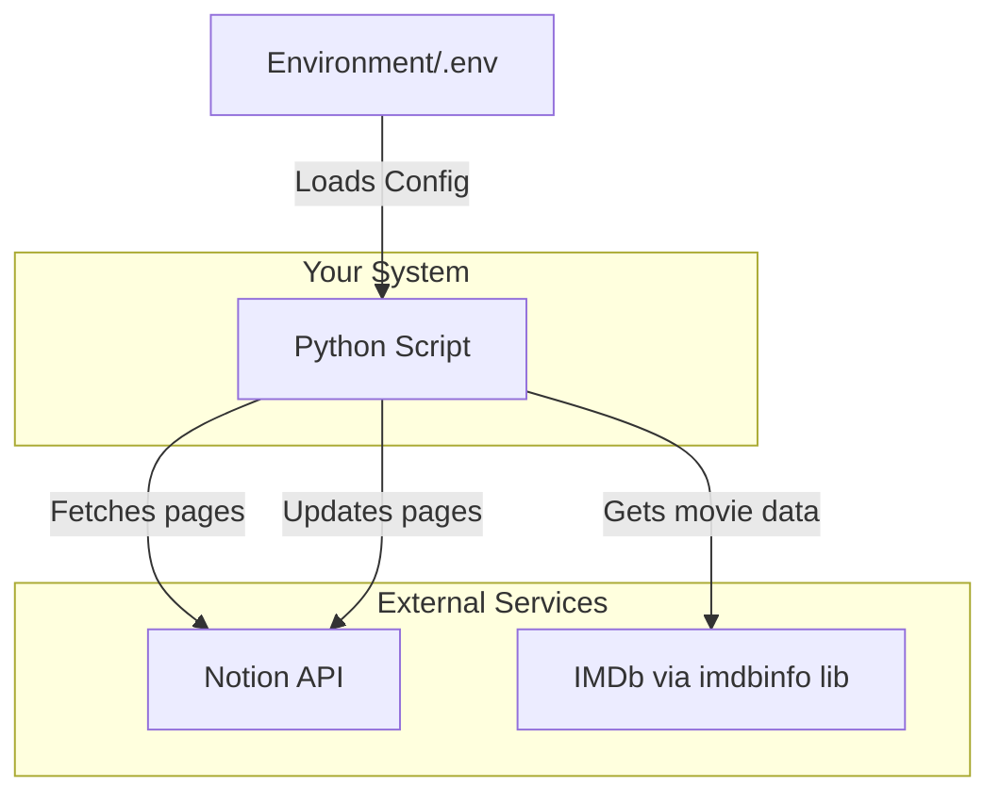

# Architecture Diagram

This diagram shows the high-level structure of your application. It illustrates the main components: the script itself, the external services it communicates with (Notion and IMDb), and how configuration is loaded.

