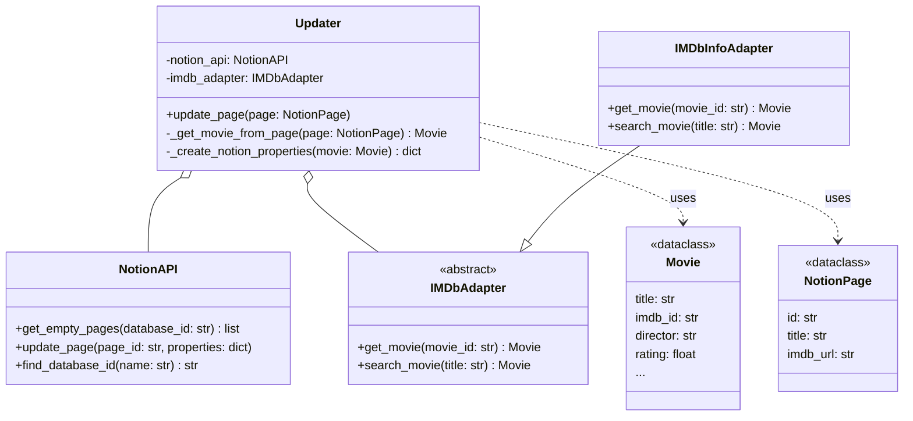

# Class Diagram

This diagram shows the key classes in your application, their most important methods, and the relationships between them. It helps to understand the object-oriented structure of the code.

