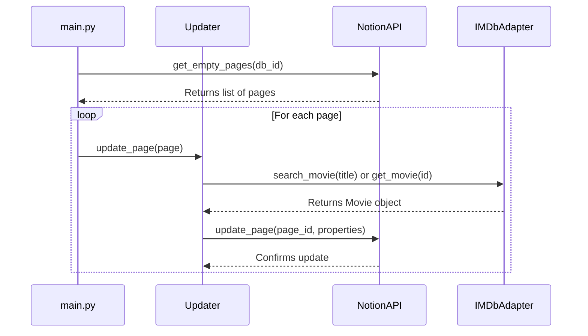

# Sequence Diagram

This diagram details the step-by-step logic of the main update process. It shows how the different objects in your code interact with each other in order to find and update a movie page in Notion.

